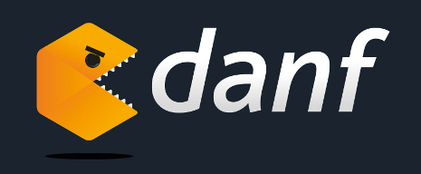

===========================================

[![NPM Version][npm-image]][npm-url]
[![NPM Downloads][downloads-image]][downloads-url]
[![Build Status][travis-image]][travis-url]
[![Dependency Status][versioneye-image]][versioneye-url]

Introduction
------------

Danf is a Node.js full-stack isomorphic OOP framework allowing to code the same way on both client and server sides. It provides many features in order to help produce scalable, maintainable, testable and performant applications.

### Why use node Node.js instead of another language/technology?

You certainly can find lots of reasons but there are 2 which make the success of Node.js before all others:
- use the same language on both client and server sides
- handle I/O in an asynchronous way to maximize your CPU load thanks to the main event loop

### Why use Danf?

Danf reinforces the promises of Node.js:
- use the same code on both client and server sides *(in a classic Node.js style)*
- maximize the power of asynchronicity thanks to a nice and innovative abstraction layer *(built upon [Async.js](https://github.com/caolan/async))*

### Why use Danf instead of another framework?

Danf is not better as any other existing framework but it has its own proposal. Most of Node.js web frameworks give you a structure to code the facade of your applications, like an easy way to define a REST API for example. Sometimes you can link this facade to some data in a mongodb database, if your are lucky.

Danf do not care of what kind of database you use (use one for each specific need!). Instead, it provides a strong structure to harness the power of Node.js and create web applications (site, API, ...) in an easy way. But that's not all. It gives you a way to define a deep, maintenable and scalable architecture thanks to a great OOP layout implementing [features coming from years of reflection by the community on how to make pragmatic and industrial OOP applications](resource/private/doc/concepts.md) (interfaces, dependency injection, ...).

**You can code big performant applications with a deep and strong architecture in an easy way and share your code thanks to a transparent module mechanism only requiring to use [npm](https://www.npmjs.com/) in the most standard way.**

Installation
------------

### Create a proto application

The better way to create a new application/danf module (in Danf an application is a **danf module** and conversely) is to let [Yeoman](http://yeoman.io/) do it for you!

First, install Yeoman:
```sh
$ npm install -g yo
```

Then, install the specific generator for Danf applications:
```sh
$ npm install -g yo generator-danf
```

Finally, create an application using:
```sh
$ yo danf
```

### Start the server

After creating your application, you should be able to start the server in this way:
```sh
$ node app-dev
```

A welcome message is waiting for you at `http://localhost:3080`!

> Use `app-prod` to start the server in prod environment (less debugging, more performances!).

### Run the tests

You can run the tests of your application thanks to:
```sh
$ make test
```

Hello world
-----------

Here is the traditional hello world (even if it does not say a lot of things about the framework)!

```javascript
// config/server/config/events/request.js

'use strict';

module.exports = {
    helloWorld: {
        path: '/',
        methods: ['get'],
        view: {
            text: {
                value: 'Hello world!'
            }
        }
    }
};
```

Features
--------

Here is the list of the major features proposed by Danf:
- An object-oriented programming layer (formal classes, easy inheritance, ensured interfaces, ...).
- An inversion of control design (dependency injection via configuration files).
- A perfect isomorphism allowing to use the same code on both client and server sides (in a standard Node.js coding style).
- A homogeneous way to handle all kind of events (HTTP requests, DOM events, ...).
- An original abstraction layer over [Async.js](https://github.com/caolan/async) to manage asynchronicity.
- A helper to develop ultra performant ajax applications supporting deep linking.
- A natural approach to share your modules and use others just using [npm](https://www.npmjs.com/).
- Some other helpful sub features to easily manage cookies, session, ...

Community
---------

Danf is a young framework and the community is still small but active. You can post your issues on [github](https://github.com/gnodi/danf/issues) or on [stack overflow](http://stackoverflow.com/) with the tag `danf` and you will get an answer as quickly as possible.

If you want to contribute, here is a not limited list of how to do:

- Fork the project on [github](https://github.com/gnodi/danf) and improve framework's features, documentation, ...
- Code your own module. In Danf, an application is a **danf module** and conversely. This way you can easily share your modules with other people simply using [npm](https://www.npmjs.com/).
- Participate to the community in asking questions in the issues or on stack overflow.

Documentation
-------------

Learn more about the framework in the [documentation](resource/private/doc/index.md).

Tests
-----

You can run the tests of the framework using:
```sh
$ make test
```

License
-------

Open Source Initiative OSI - The MIT License

http://www.opensource.org/licenses/mit-license.php

Copyright (c) 2014 Thomas Prelot

Permission is hereby granted, free of charge, to any person obtaining
a copy of this software and associated documentation files (the
"Software"), to deal in the Software without restriction, including
without limitation the rights to use, copy, modify, merge, publish,
distribute, sublicense, and/or sell copies of the Software, and to
permit persons to whom the Software is furnished to do so, subject to
the following conditions:

The above copyright notice and this permission notice shall be
included in all copies or substantial portions of the Software.

THE SOFTWARE IS PROVIDED "AS IS", WITHOUT WARRANTY OF ANY KIND,
EXPRESS OR IMPLIED, INCLUDING BUT NOT LIMITED TO THE WARRANTIES OF
MERCHANTABILITY, FITNESS FOR A PARTICULAR PURPOSE AND
NONINFRINGEMENT. IN NO EVENT SHALL THE AUTHORS OR COPYRIGHT HOLDERS BE
LIABLE FOR ANY CLAIM, DAMAGES OR OTHER LIABILITY, WHETHER IN AN ACTION
OF CONTRACT, TORT OR OTHERWISE, ARISING FROM, OUT OF OR IN CONNECTION
WITH THE SOFTWARE OR THE USE OR OTHER DEALINGS IN THE SOFTWARE.

[npm-image]: https://img.shields.io/npm/v/danf.svg?style=flat
[npm-url]: https://npmjs.org/package/danf
[downloads-image]: https://img.shields.io/npm/dm/danf.svg?style=flat
[downloads-url]: https://npmjs.org/package/danf
[travis-image]: https://img.shields.io/travis/gnodi/danf.svg?style=flat
[travis-url]: https://travis-ci.org/gnodi/danf
[versioneye-image]:https://www.versioneye.com/user/projects/54da27f8c1bbbd5f8200020a/badge.svg?style=flat
[versioneye-url]:https://www.versioneye.com/user/projects/54da27f8c1bbbd5f8200020a