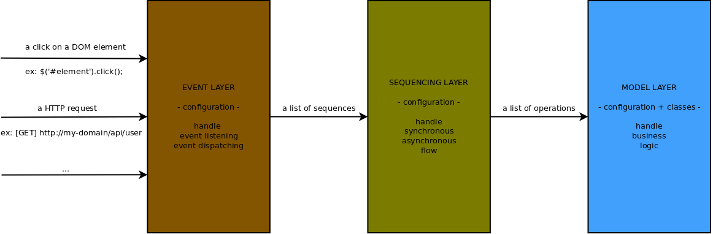

-> Factories

Dependency Injection
====================

[←](../index.md)



Documentation
-------------

Dependency injection allows to inject dependencies in a dynamic way. It is certainly the most important concept to apply in order to realize a strong, decoupled, reusable, maintainable, testable architecture.

### Define a service

In Danf, services are the base of the dependency injection. They are defined in the config.

#### Class

The most basic definition of a concrete service only requires a class. The first thing to do is to implement your service class:

```javascript
// lib/common/computer.js

'use strict';

module.exports = Computer;

function Computer() {
}

Object.defineProperty(Computer.prototype, 'host', {
    get: function() { return this._host; },
    set: function(host) { this._host = host; }
});

Computer.prototype.compute = function() {
    // ...
}
```

Then, you can define your service like that:

```javascript
// config/common/config/services.js

'use strict';

module.exports = {
    computer: {
        class: 'computer'
    }
};
```

#### Properties

You can pass some values and inject some dependencies thanks to the attribute `properties`:

```javascript
// config/common/config/services.js

'use strict';

module.exports = {
    processor: {
        class: 'processor'
    },
    computer: {
        class: 'computer',
        properties: {
            host: '127.0.0.1',
            processor: '#processor#'
        }
    }
};
```

The classes for the service `processor` is not detailed here, that is not the point. You can pass a value simply by associating a name of a property and a value: `host: '127.0.0.1'`. You can, also, inject a service using the reference of type `#`. Here, we injected the service `processor` to the service `computer` with `processor: '#processor#'`. Note that you can inject the service of one of your dependency (danf module), by prefixing the reference with its contextual namespace: `processor: '#processingModule:processor#'`.

You can make some improvements to the class in order to check that all dependencies will be correctly injected using the method `defineDependency` on the class:

```javascript
// lib/common/computer.js

'use strict';

module.exports = Computer;

function Computer() {
}

Computer.defineImplementedInterfaces(['computer']);

Computer.defineDependency('_host', 'string');
// Check _processor dependency is an instance of the interface processor.
Computer.defineDependency('_processor', 'processor');

Object.defineProperty(Computer.prototype, 'host', {
    get: function() { return this._host; },
    set: function(host) { this._host = host; }
});

Object.defineProperty(Computer.prototype, 'processor', {
    get: function() { return this._processor; },
    set: function(host) { this._processor = processor; }
});

Computer.prototype.compute = function() {
    // ...
}
```

It is a really good practice to define your public properties with `Object.defineProperty` to handle the accessibility to the corresponding private `_` prefixed properties.

#### Abstract

Sometimes, you would like to define some base for other services inside your own module or for the ones using your module. However, it is not an instantiable service because it needs some more properties for instance. In that cases, you can use the attribute `abstract`:

```javascript
// config/common/config/services.js

'use strict';

module.exports = {
    baseComputer: {
        abstract: true,
        properties: {
            host: '127.0.0.1'
        }
    }
};
```

> Attribute `class` is not mandatory for that kind of service.

#### Parent

You can inherit from a parent service to override another definition:

```javascript
// config/common/config/services.js

'use strict';

module.exports = {
    baseComputer: {
        abstract: true,
        properties: {
            host: '127.0.0.1'
        }
    },
    processor: {
        class: 'processor'
    },
    computer: {
        parent: 'baseComputer',
        class: 'computer',
        properties: {
            host: 'localhost',
            processor: '#processor#'
        }
    }
};
```

> Attribute `abstract` is not inherited.

#### Children

In some cases, you have to define some homogeneous services. The attribute `children` allows you to easily and visually arrange that:

```javascript
// config/common/config/services.js

'use strict';

module.exports = {
    processor: {
        class: 'processor'
    },
    computer: {
        class: 'computer',
        properties: {
            processor: '#processor#'
        },
        children: {
            local: {
                properties: {
                    host: '127.0.0.1'
                }
            },
            remote: {
                properties: {
                    host: '192.168.0.1'
                }
            }
        }
    }
};
```

This will create 3 definitions of services, 1 abstract: `computer` and 2 definitions which will result in an instanciation: `computer.local` and `computer.remote`. For each child, you can define all the attributes of a standard service (including `children` if you want to chain this structure). The relation between the parent and its children works the same as for the attribute `parent`.

#### Declinations

Another way to define homogeneous services is to use the attribute `declinations`. Here is an equivalent of the example for the attribute `children` but with declinations:

```javascript
// config/common/config/services.js

'use strict';

module.exports = {
    processor: {
        class: 'processor'
    },
    computer: {
        class: 'computer',
        declinations: {
            local: {
                host: '127.0.0.1'
            },
            remote: {
                host: '192.168.0.1'
            }
        },
        properties: {
            host: '@host@',
            processor: '#processor#'
        }
    }
};
```

This will do exactly the same as the previous example with `children`. The reference of type `@` use the context of the declinations. For `computer.local`, `@host@` resolves in `'127.0.0.1'`.

So, when to use `children` and when to use `declinations`? `children` allows you to override each attribute of the parent whereas `declinations` only processes on the properties. However, `declinations` provides a simple way to make declinations of services from the configuration. For instance:

```javascript
// config/common/config/this.js

'use strict';

module.exports = {
    computers: {
        local: {
            host: '127.0.0.1'
        },
        remote: {
            host: '192.168.0.1'
        }
    }
};
```

The associated contract for this config is not given here but remember that you have to define a corresponding one.

```javascript
// config/common/config/services.js

'use strict';

module.exports = {
    processor: {
        class: 'processor'
    },
    computer: {
        class: 'computer',
        declinations: '$computers$',
        properties: {
            host: '@host@',
            processor: '#processor#'
        }
    }
};
```

This will do exactly the same as the previous example, you just set the definition of the declinations in your configuration (instead than directly in the definition of the service) thanks to the reference `$computers$` of type `$` which use the config as its context. This allows, for example, to use the check mechanism of the contract on the definition of the declinations.

> You cannot use `declinations` and `children` in the same definition.

> Remember that [references can be used in a concatenation mode](configuration.md). You might want to use a form like `host: '@host@:@port@'` to add a port for instance.

#### Collections

You can add your homogeneous services to a collection in order to inject all of them to another service:

```javascript
// config/common/config/services.js

'use strict';

module.exports = {
    computer: {
        class: 'computer',
        collections: ['computer'],
        children: {
            local: {
                properties: {
                    host: '127.0.0.1'
                }
            },
            remote: {
                properties: {
                    host: '192.168.0.1'
                }
            }
        }
    },
    synchronizer: {
        class: 'synchronizer',
        properties: {
            computers: '&computer&'
        }
    }
};
```

The services `computer.local` and `computer.remote` are part of the collection `computer`. These services are injected to the service `synchronizer` thanks to the reference `&computer&` of type `&` which use the collections context. The attribute `collections` is an array, which means you can define many collections for a same service.

> The collections of a parent service are added to the children's ones.

Let's see the implementation of the class of the service `synchronizer`:

```javascript
// lib/common/synchronizer.js

'use strict';

module.exports = Synchronizer;

function Synchronizer() {
}

Synchronizer.defineDependency('_computers', 'computer_array');

Object.defineProperty(Synchronizer.prototype, 'computers', {
    get: function() { return this._computers; },
    set: function(computers) { this._computers = computers; }
});

Synchronizer.prototype.compute = function() {
    // ...
}
```

`Synchronizer.defineDependency('_computers', 'computer_array');` means that the private property `_computers` should be an array of objects whom classes implement the interface `computer`.

#### Registry

You can use a service as a registry. To do this, use the attribute `registry`:

```javascript
// config/common/config/services.js

'use strict';

module.exports = {
    itemsRegistry: {
        class: 'itemsRegistry',
        registry: {
            method: 'get',
            namespace: [1]
        }
    }
};
```

This allows to use this service to inject objects/values retrieved with its method `get`. Imagine the following class for `itemsRegistry`:

```javascript
// lib/common/items-registry.js

'use strict';

module.exports = ItemsRegistry;

function ItemsRegistry() {
}

ItemsRegistry.prototype.get = function(category, name) {
    // ...

    return item;
}
```

You will then be able to inject some items into other services thanks to the reference `#itemsRegistry[computing][mouse]#`.

`namespace` is used to tell the arguments which should be namespaced. Here this is the second one (`[1]`), so `mouse` will be namespaced with the current module contextual namespace (something like `main:mouse`).

#### Factories

You can control the instantiation of a service injected into another. To do this, use the attributes `factories` and `induced`:

```javascript
// config/common/config/services.js

'use strict';

module.exports = {
    database: {
        class: function() { this.type = 'database'; },
        declinations: '$databases$',
        properties: {
            name: 'database @_@'
        },
        collections: ['databases'],
        induced: {
            collection: {
                service: 'collection',
                factory: 'database',
                context: '@.@',
                property: 'collections',
                collection: true
            }
        }
    },
    collection: {
        class: function() { this.type = 'collection'; },
        factories: {
            database: {
                declinations: '!collections!',
                properties: {
                    name: 'collection @name@'
                }
            }
        }
    }
};
```

`!collections!` is a reference of type '!' resolving in the context given in `induced.collection.context`.
`$databases$` is a reference of type `$` resolving in the context of the config. Here is a possible config:

```javascript
// config/common/config/this.js

'use strict';

module.exports = {
    databases: {
        forums: {
            name: 'forum',
            collections: {
                forums: {
                    name: 'forum'
                },
                topics: {
                    name: 'topic'
                }
            }
        },
        users: {
            name: 'user',
            collections: {
                users: {
                    name: 'author'
                }
            }
        }
    }
};
```

This config will induce the creation of 5 services:
- `databases.forums`
- `databases.forums.collection.forums`
- `databases.forums.collection.topics`
- `databases.users`
- `databases.users.collection.users`

`databases.forums` will have the services `databases.forums.collection.forums` and `databases.forums.collection.topics` injected in an array in the property `collections`.

`databases.users` will have the service `databases.forums.collection.users` injected in an array in the property `collections`.

> In fact, `factories` act as standard service definitions with an additional context passed by the caller. Note that a factory inherit from the attributes of the service it belongs to.

#### Alias

You can define aliases to refer to a service with a different name thanks to the attribute `alias`:

```javascript
// config/common/config/services.js

'use strict';

module.exports = {
    computer: {
        class: 'computer',
        children: {
            local: {
                properties: {
                    host: '127.0.0.1'
                }
            },
            remote: {
                properties: {
                    host: '192.168.0.1'
                }
            }
        }
    },
    defaultComputer: {
        alias: 'computer.local'
    }
};
```

> Obviously, you cannot use anything else than the attribute `alias` for the definition of an aliased service.

### Inject an instance of a class which is not a service

Of course, some of your classes are not instantiated as services (as data class for instance). The way to work with that kind of objects in Danf is to use providers:

```javascript
// config/common/config/services.js

'use strict';

module.exports = {
    operationProvider: {
        parent: 'danf:dependencyInjection.objectProvider',
        properties: {
            class: 'operation',
            interface: 'operation',
            properties: {
                logger: '#danf:logging.logger#'
            }
        }
    },
    processor: {
        class: 'processor',
        properties: {
            operationProvider: '#operationProvider#'
        }
    }
}
```

You have to specify the class of provided objects. The interface is optional.

> You can inject dependencies as for services thanks to the property `properties`.

Here is the implementation of the class `operation`:

```javascript
// lib/common/operation.js

'use strict';

module.exports = Operation;

function Operation() {
}

Operation.defineImplementedInterfaces(['operation']);

Operation.defineDependency('_code', 'string');
Operation.defineDependency('_logger', 'danf:logging.logger');

Object.defineProperty(Operation.prototype, 'code', {
    get: function() { return this._code; },
    set: function(code) { this._code = code; }
});

Object.defineProperty(Operation.prototype, 'logger', {
    get: function() { return this._logger; },
    set: function(logger) { this._logger = logger; }
});
```

You can use the provider service like the following:

```javascript
// lib/common/processor.js

'use strict';

module.exports = Processor;

function Processor() {
}

Processor.defineImplementedInterfaces(['processor']);

Processor.defineDependency('_operationProvider', 'danf:dependencyInjection.provider', 'operation');

Object.defineProperty(Processor.prototype, 'operationProvider', {
    get: function() { return this._operationProvider; },
    set: function(operationProvider) { this._operationProvider = operationProvider; }
});

Processor.prototype.process = function() {
    var newOperation = this._operationProvider.provide(
            {
                code: '01001011'
            }
        )
    ;

    // ...
}
```

`Processor.defineDependency('_operationProvider', 'danf:dependencyInjection.provider', 'operation');` means that you use a provider of objects coming from a class implementing the interface `operation`. The object passed as method `provide` first argument will be injected into the created object properties (here `'01001011'` will be injected in the property `code`).

> Remember that a service is shared between all the requests/users, so you should not use this to set a particular state in your services.

Navigation
----------

[< OOP](oop.md) | [Sequencing >](sequencing.md)

[←](../index.md)
