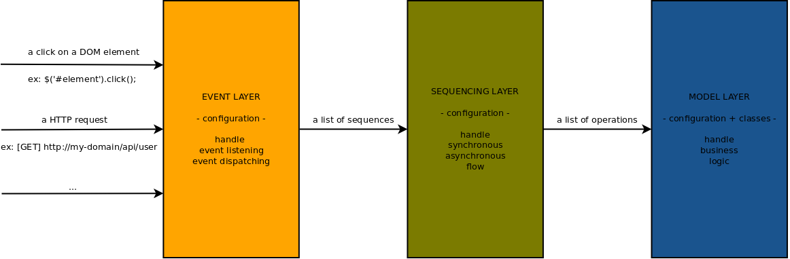

Events
======

[←](../index.md)



Documentation
-------------

In Danf, all actions are initiated by an event. The framework allows to handle all incoming events the same way. For instance, a HTTP request event will be handled as a click in the browser.

### Handle an event

There are several available kinds of events which define their own description for an event but the flow is the same for all:
- An catched event leads to the execution of some associated sequences.
- A sequence is a list of operations (methods of services) with some optional conditional statements.
- A stream is injected at the start of the sequences and each operation of each sequence can alter the stream.
- A context is passed along all the executed sequences.

Let's explain the different types of event available by default.

#### Event

The type `event` is the basic type for events and is available for both client and server sides:

```javascript
// config/common/config/events/event.js

'use strict';

module.exports = {
    happenSomething: {
        data: {
            i: {
                type: 'number',
                default: 0
            }
        },
        context: {
            j: 2
        },
        callback: function(stream) {
            console.log(stream.result);
        },
        sequences: [
            {
                name: 'doSomething',
                input: {
                    i: '@i@'
                },
                output: {
                    result: '@result@'
                }
            }
        ]
    }
};
```

* `data`: optional contract to check the format of data passed on event triggering.
* `context`: optional context that will be passed along of executed sequences.
* `callback`: optional callback that will be executed at the end of the execution of the sequence with the resulting output stream as first parameter.
* `sequences`: list of sequences to execute.

The input stream is the data passed at the event triggering.

The event context is the one passed in the attribute `context`.

#### Request

The type `request` is the type for HTTP request events and is available for both the client and server sides:
- On the server side the event catch a HTTP request and process it to make a response.
- On the client side the event send a HTTP request and process the response.

```javascript
// config/server/config/events/request.js

'use strict';

module.exports = {
    home: {
        path: '/schedule',
        methods: ['get'],
        headers: {
            'X-Powered-By': 'Danf'
        },
        parameters: {
            value: {
                type: 'number',
                required: true
            },
            inc: {
                type: 'number',
                default: 1
            }
        },
        view: {
            text: {
                Start in: @start@
            },
            json: {
                select: {
                    start: '@start@'
                }
            },
            html: {
                layout: {
                    file: '%view.path%/layout.jade'
                },
                body: {
                    file: '%view.path%/index.jade'
                }
            }
        },
        sequences: [
            {
                name: 'schedule'
            }
        ]
    }
};
```

* `path`: path of the URL.
* `methods`: list of the available HTTP methods for this path.
* `host`: host name with a default to `localhost`.
* `headers`: optional list of headers to send in the response.
* `parameters`: optional contract to check the format of the request parameters.
* `sequences`: list of sequences to execute.

Only on server side:
* `view`: parameters for the different renderings.

Only on client side:
* `process`: status which will process the sequences (possible values are `done`, `fail` or `always` with default to `done`).
* `settings`: specific [jquery ajax settings](http://api.jquery.com/jquery.ajax/) (some will be overridden like `url`, `method`, ...).

> In this example, you have three possible rendering formats (text, JSON and HTML).
> `%view.path%` is a parameter containing the path of your current module (`resource/private/view` by default).
> [Jade](http://jade-lang.com/) is the default template engine, but you can use another one [like explained in Express](http://expressjs.com/guide/using-template-engines.html).

The input stream for a request event on the server side are the `req.query` and `req.params` of [Express](http://expressjs.com/).
The input stream for a request event on the client side is the response ajax data of [JQuery](http://api.jquery.com/jquery.ajax/).

The event context is of the form:

```javascript
{
    request: request,
    response: response
}
```

* `request`: request data (express object on the server side).
* `response`: response data (express object on the server side).

#### Dom

The type `dom` is the type for DOM events and is only available for the client side:

```javascript
// config/client/config/events/dom.js

'use strict';

module.exports = {
    elementInitialization: {
        selector: '#element',
        event: 'ready',
        sequences: [
            {
                name: 'initializeElement'
            }
        ]
    },
    elementClick: {
        selector: '#element',
        event: 'click',
        preventDefault: true,
        stopPropagation: true,
        sequences: [
            {
                name: 'hideSomething'
            },
            {
                name: 'displaySomething'
            }
        ]
    }
};
```

* `selector`: impacted DOM elements.
* `delegate`: delegate for the event.
* `event`: kind of event.
* `preventDefault`: prevent the default behaviour (default false).
* `stopPropagation`: stop the propagation of the event in the DOM tree (default false).
* `data`: optional contract to check the format of data passed on manual event triggering.
* `sequences`: list of sequences to execute.

As you probably guess, [JQuery](http://jquery.com/) is used here. So you can refer to its own documentation for selectors, events, ...

The event context is of the form:

```javascript
{
    name: name,
    event: event
}
```

* `name`: name of the event.
* `event`: jquery event object.

For instance, you can access the jquery element which is processing the event with `!event.target!`.

> You can use JQuery as a service. Danf is already defining this service for you: `danf:vendor.jquery`.

The input stream for a dom event is the event data of [JQuery](https://api.jquery.com/category/events/).

### Factorize an event definition

You can factorize events definition using children:

```javascript
// config/common/config/events/request.js

'use strict';

module.exports = {
    apiUser: {
        path: '/api/users',
        view: {
            json: {
                value: {
                    result: '@value@'
                }
            }
        },
        children: {
            get: {
                path: '/:id',
                methods: ['get']
            },
            post: {
                methods: ['post']
            }
        }
    }
};
```

This will give you two routes:
- `[GET] /api/users/:id`
- `[POST] /api/users`

You can factorize event available on both sides defining it in the common folder. In the case of type `request` for instance, you can add specific parameters for each sides in the client and server folder:

```javascript
// config/server/config/events/request.js

'use strict';

module.exports = {
    apiUser: {,
        children: {
            get: {
                view: {
                    json: '@user@'
                }
            },
            post: {
                view: {
                    json: {
                        id: '@user.id@'
                    }
                }
            }
        }
    }
};
```

> Attribute `children` can be embedded many times!

### Trigger an event manually

The service `danf:event.eventsContainer` can be used as a registry for injection. This means that you can inject an event thanks to the reference: `#danf:event.eventsContainer[request][apiUser.get]#`.

You can then trigger the event using:

```javascript
event.trigger(data || {});
```

> Prefer service `danf:http.router` if you want to execute HTTP sub-requests.

Navigation
----------

[< Sequencing](sequencing.md) | [Ajax App >](ajax-app.md)

[←](../index.md)
