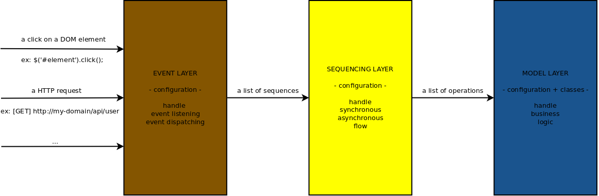

Sequencing
==========

[←](../index.md)



Documentation
-------------

### Handle an asynchrone task

Here is a perfectly synchronous computer:

```javascript
// lib/common/computer.js

'use strict';

module.exports = function Computer() {
}

Computer.prototype.add = function (value, operand) {
    return value + operand;
}

Computer.prototype.mul = function (value, operand) {
    return value * operand;
}
```

Here is now, the asynchronous version:

```javascript
// lib/common/async-computer.js

'use strict';

module.exports = function AsyncComputer() {
}

AsyncComputer.prototype.add = function (value, operand) {
    this.__asyncProcess(function(returnAsync) {
        setTimeout(
            function() {
                returnAsync(value + operand);
            },
            10
        );
    });
}

AsyncComputer.prototype.mul = function (value, operand) {
    this.__asyncProcess(function(returnAsync) {
        setTimeout(
            function() {
                returnAsync(function(value) {
                    return value * operand;
                });
            },
            10
        );
    });

    return value;
}
```

`setTimeout` is used here to simulate an asynchrone task. In Danf, all you have to do to make an asynchronous task be compatible with the flow is to wrap it with `this.__asyncProcess(function(returnAsync) {` and use `returnAsync()` instead of a simple `return`. You will see in the next chapter what this little wrapping allows you to do.

Method `mul` has a slightly different implementation. This shows how to code a method which have a synchronous and an asynchronous return or which can be called on the same scope in parallel for instance. The first argument passed to the callback in `returnAsync` is the actual scoped value. You will see in the next chapter how to work with scopes.

The last one is a proxy computer which is not directly processing an asynchronous task but call a method of the asynchronous computer which process an asynchronous task:

```javascript
// lib/common/proxy-computer.js

'use strict';

module.exports = function ProxyComputer() {
}

Object.defineProperty(ProxyComputer.prototype, 'computer', {
    set: function(computer) { this._computer = computer; }
});

ProxyComputer.prototype.add = function (value, operand, scope) {
    this._computer.add.__asyncCall(
        this._computer,
        scope,
        value,
        operand
    );
}

ProxyComputer.prototype.mul = function (value, operand, scope) {
    this._computer.mul.__asyncApply(
        this._computer,
        scope,
        [value, operand]
    );
}
```

As you would use `call` or `apply` in javascript, Danf provides the asynchronous versions `__asyncCall` and `__asyncApply` of these methods.
The first argument is the context object (`this`) and the second one is the scope of the flow.

The services defined from these classes are of this form:

```javascript
// config/common/config/services.js

'use strict';

module.exports = {
    computer: {
        class: 'computer'
    },
    asyncComputer: {
        class: 'asyncComputer'
    },
    proxyComputer: {
        class: 'proxyComputer',
        properties: {
            computer: '#asyncComputer#'
        }
    }
};
```

### Define a sequence

A sequence is the base element to handle the flow. It is an abstraction layer helping you to work with asynchronicity. You can easily define operations executing in parallel (at the same time) or in series (one after the other). Let's explain it with some progressive examples.

#### Execute a simple operation

A sequence is a list of operations. An operation is a call on a method of a service with some arguments. When a sequence is executed, a stream is send and can be impacted by each operation.

```javascript
// config/common/config/sequences.js

'use strict';

module.exports = {
    add: {
        operations: [
            {
                service: 'computer',
                method: 'add',
                arguments: [2, 3],
                scope: 'result'
            }
        ]
    }
};
```

**Execution details:**

1. Execute operation `computer.add(2, 3)`.
2. Set result in the stream field defined by the scope `result`.

**Execution example:**
- input `{}` => output: `{result: 5}`

> - A scope of value `null` does not impact the stream of the operation return.
> - A scope of value `'.'` impacts all the stream.

#### Execute an operation with some input stream value

You can resolve and check the input stream with a contract thanks to the attribute `stream`.

```javascript
// config/common/config/sequences.js

'use strict';

module.exports = {
    addInputStream: {
        stream: {
            value: {
                type: 'number',
                default: 4
            }
        },
        operations: [
            {
                service: 'computer',
                method: 'add',
                arguments: ['@value@', 3],
                scope: 'result'
            }
        ]
    }
};
```

**Execution details:**

1. Resolve the input stream. If field `value` is not given, default to `4`.
2. Execute operation `computer.add('@value@', 3)`.
3. Set result in the stream field `result`.

**Execution examples:**
- input `{value: 1}` => output: `{value: 1, result: 4}`
- input `{}` => output: `{value: 4, result: 7}`

> `@value@` is a reference resolved in the context of the sequence stream.

#### Execute a simple asynchronous operation

You can execute some asynchronous operation.

```javascript
// config/common/config/sequences.js

'use strict';

module.exports = {
    addAsync: {
        operations: [
            {
                service: 'asyncComputer',
                method: 'add',
                arguments: [2, 3],
                scope: 'result'
            }
        ]
    }
};
```

**Execution details:**

1. Execute operation `asyncComputer.add(2, 3)`.
2. Set result in the stream field `result`.

**Execution example:**
- input `{}` => output: `{result: 5}`

> There is no difference between a simple asynchronous operation and its asynchronous counterpart.

#### Execute several synchronous operations

Of course, it is possible to call several operations.

```javascript
// config/common/config/sequences.js

'use strict';

module.exports = {
    addMultiSync: {
        stream: {
            value: {
                type: 'number'
            }
        },
        operations: [
            {
                service: 'computer',
                method: 'add',
                arguments: ['@value@', 3],
                scope: 'value'
            },
            {
                service: 'computer',
                method: 'add',
                arguments: ['@value@', 3],
                scope: 'value'
            }
        ]
    }
};
```

**Execution details:**

1. Resolve the input stream.
2. Execute operation `computer.add('@value@', 3)`.
3. Set result in the stream field `value`.
4. Execute operation `computer.add('@value@', 3)`.
5. Set result in the stream field `value`.

**Execution example:**
- input `{value: 1}` => output: `{value: 7}`

> The operations are executed one after the other.

#### Execute several asynchronous operations in parallel

It is possible to do the same thing with asynchronous operations.

```javascript
// config/common/config/sequences.js

'use strict';

module.exports = {
    addMultiAsyncParallel: {
        stream: {
            value: {
                type: 'number'
            }
        },
        operations: [
            {
                service: 'asyncComputer',
                method: 'add',
                arguments: ['@value@', 3],
                scope: 'value'
            },
            {
                service: 'asyncComputer',
                method: 'add',
                arguments: ['@value@', 3],
                scope: 'value'
            }
        ]
    }
};
```

**Execution details:**

1. Resolve the input stream.
2. At the same time.
    - Execute operation `asyncComputer.add('@value@', 3)`.
    - Execute operation `asyncComputer.add('@value@', 3)`.
3. At the same time.
    - Set result in the stream field `value`.
    - Set result in the stream field `value`.

**Execution example:**
- input `{value: 1}` => output: `{value: 4}`

> The result is due to the fact that both operations are executed at the same time. Why? Because you do not wait the end of the first asynchronous operatio before starting the second one.

#### Execute several asynchronous operations in series

To handle asynchronous operations execution order, you can use the attribute `order` which is by default set to `0`. Asynchronous operations with the same order are executed in parallel whereas operations with a different order are executed in series.

```javascript
// config/common/config/sequences.js

'use strict';

module.exports = {
    addMultiAsyncSeries: {
        stream: {
            value: {
                type: 'number'
            }
        },
        operations: [
            {
                order: 0,
                service: 'asyncComputer',
                method: 'add',
                arguments: ['@value@', 3],
                scope: 'value'
            },
            {
                order: 1,
                service: 'asyncComputer',
                method: 'add',
                arguments: ['@value@', 3],
                scope: 'value'
            }
        ]
    }
};
```

**Execution details:**

1. Resolve the input stream.
2. Execute operation `asyncComputer.add('@value@', 3)`.
3. Set result in the stream field `value`.
4. Execute operation `asyncComputer.add('@value@', 3)`.
5. Set result in the stream field `value`.

**Execution example:**
- input `{value: 1}` => output: `{value: 7}`

> The only difference with its synchronous counterpart is the use of the attribute `order`.

#### Execute children sequences

You can factorize sequences using the attribute `children`. This allows you to call a other sequence as it would be an operation of your sequence.

```javascript
// config/common/config/sequences.js

'use strict';

module.exports = {
    computeChildrenParent: {
        stream: {
            value: {
                type: 'number'
            }
        },
        operations: [
            {
                order: 0,
                service: 'asyncComputer',
                method: 'add',
                arguments: ['@value@', 6],
                scope: 'value'
            }
        ],
        children: [
            {
                name: 'computeChildrenChild',
                order: -1,
                input: {
                    value: '@value@'
                },
                output: {
                    value: '@value@'
                }
            },
            {
                name: 'computeChildrenChild',
                order: 1,
                input: {
                    value: '@value@'
                },
                output: {
                    value: '@value@'
                }
            }
        ]
    },
    computeChildrenChild: {
        stream: {
            value: {
                type: 'number'
            }
        },
        operations: [
            {
                order: 0,
                service: 'asyncComputer',
                method: 'mul',
                arguments: ['@value@', 2],
                scope: 'value'
            }
        ]
    }
};
```

**Execution details for sequence `computeChildrenParent`:**

1. Resolve the input stream.
2. Execute child sequence `computeChildrenChild`.
    1. Set parent stream field `value`(`@value@`) in child input stream field `value`.
    2. Execute operation `asynComputer.mul('@value@', 2)`.
    3. Write child output stream field `value`(`@value@`) in parent stream field `value`.
3. Execute operation `asynComputer.add('@value@', 6)`.
4. Set result in the stream field `value`.
5. Execute child sequence `computeChildrenChild`.
    1. Set parent stream field `value`(`@value@`) in child input stream field `value`.
    2. Execute operation `asynComputer.mul('@value@', 2)`.
    3. Write child output stream field `value`(`@value@`) in parent stream field `value`.

**Execution example for sequence `computeChildrenParent`:**
- input `{value: 4}` => output: `{value: 28}`

> You can handle execution order with the attribute `order` as for any other sequence.

#### Execute parents sequences

You can also factorize in the opposite direction. A sequence can inject itself in other sequences.

```javascript
// config/common/config/sequences.js

'use strict';

module.exports = {
    computeParentParent: {
        stream: {
            value: {
                type: 'number'
            }
        },
        operations: [
            {
                order: 0,
                service: 'asyncComputer',
                method: 'add',
                arguments: ['@value@', 6],
                scope: 'value'
            }
        ],
        parents: [
            {
                target: 'computeParentChildName',
                order: -1,
                input: {
                    value: '@value@'
                },
                output: {
                    value: '@value@'
                }
            },
            {
                target: '&parentChild&',
                order: 1,
                input: {
                    value: '@value@'
                },
                output: {
                    value: '@value@'
                }
            }
        ]
    },
    computeParentChildName: {
        stream: {
            value: {
                type: 'number'
            }
        },
        operations: [
            {
                order: 0,
                service: 'asyncComputer',
                method: 'mul',
                arguments: ['@value@', 2],
                scope: 'value'
            }
        ],
        collections: ['parentChild']
    },
    computeParentChildCollection: {
        stream: {
            value: {
                type: 'number'
            }
        },
        operations: [
            {
                order: 0,
                service: 'asyncComputer',
                method: 'mul',
                arguments: ['@value@', 2],
                scope: 'value'
            }
        ],
        collections: ['parentChild']
    }
};
```

**Execution details for sequence `computeParentChildName`:**

1. Resolve the input stream.
2. Execute parent sequence `computeParentParent`.
3. Execute operation `asynComputer.mul('@value@', 2)`.
4. Set result in the stream field `value`.
5. Execute parent sequence `computeParentParent`.

**Execution example:**
- input `{value: 4}` => output: `{value: 28}`

Sequence `computeParentChildName` matches `target: 'computeParentChildName'` and `target: '&parentChild&'`.

**Execution details for sequence `computeParentChildName`:**

1. Resolve the input stream.
2. Execute parent sequence `computeParentParent`.
3. Execute operation `asynComputer.mul('@value@', 2)`.
4. Set result in the stream field `value`.
5. Execute parent sequence `computeParentParent`.

**Execution example:**
- input `{value: 4}` => output: `{value: 28}`

Sequence `computeParentChildName` only matches `target: '&parentChild&'`.

> The attribute `collections` attaches sequences to some collections.
> This allows to inject parents sequences in all the sequences of a collection thanks to `target: '&collectionName&'`.
> `&collectionName&` is a reference resolved in the context of the sequence collections.

#### Execute an operation in parallel on a collection

It is possible to execute an operation on a collection (an array or an object).

```javascript
// config/common/config/sequences.js

'use strict';

module.exports = {
    addCollectionParallel: {
        stream: {
            value: {
                type: 'number_array'
            }
        },
        operations: [
            {
                service: 'asyncComputer',
                method: 'add',
                arguments: ['@@.@@', 2],
                collection: {
                    input: '@value@',
                    method: '||'
                },
                scope: 'value'
            }
        ]
    }
};
```

**Execution details:**

1. Resolve the input stream.
2. At the same time.
    - Execute operation `asyncComputer.add('@value.0@', 3)`.
    - Execute operation `asyncComputer.add('@value.1@', 3)`.
    - ...
    - Execute operation `asyncComputer.add('@value.n@', 3)`.
3. At the same time.
    - Set result in the stream field `value.0`.
    - Set result in the stream field `value.1`.
    - ...
    - Set result in the stream field `value.n`.
4. Set result in the stream field `value`.

**Execution example:**
- input `{value: [1, 3, 8]}` => output: `{value: [3, 5, 10]}`

> Allowed values for attribute `method` of `collection` are [the name of the collection methods of the async lib](https://github.com/caolan/async#collections).
> * `||` is an alias for `forEachOf`.
> * `--` is an alias for `forEachOfSeries`.
> * `|-` is an alias for `forEachOfLimit`.

#### Execute an operation in series on a collection

It may be interesting to auto aggregate the result of a collection executing in series. You can do it thanks to the attribute `aggregate` of the `collection`.

```javascript
// config/common/config/sequences.js

'use strict';

module.exports = {
    addCollectionSeries: {
        stream: {
            value: {
                type: 'number_array'
            },
            result: {
                type: 'number',
                default: 2
            }
        },
        operations: [
            {
                service: 'asyncComputer',
                method: 'add',
                arguments: ['@@.@@', '@result@'],
                collection: {
                    input: '@value@',
                    method: '--',
                    aggregate: true
                },
                scope: 'result'
            }
        ]
    }
};
```

**Execution details:**

1. Resolve the input stream.
2. Execute operation `asyncComputer.add('@value.0@', @result@)`.
3. Set result in the stream field `result` (thanks to `aggregate: true`).
4. Execute operation `asyncComputer.add('@value.1@', @result@)`.
5. Set result in the stream field `result`.
6. ...
7. Execute operation `asyncComputer.add('@value.n@', @result@)`.
8. Set result in the stream field `result`.

**Execution example:**
- input `{value: [1, 3, 8]}` => output: `{value: [1, 3, 8], result: 14}`

#### Execute an operation on a collection with an aggregation on the result

It is also possible to aggregate the result at the end operation on all items passing a function to the attribute `aggregate` of the `collection`.

```javascript
// config/common/config/sequences.js

'use strict';

module.exports = {
    addCollectionAggregate: {
        stream: {
            value: {
                type: 'number_array'
            }
        },
        operations: [
            {
                service: 'asyncComputer',
                method: 'add',
                arguments: ['@@.@@', 2],
                collection: {
                    input: '@value@',
                    method: '|-',
                    parameters: {
                        limit: 1
                    },
                    aggregate: function(value) {
                        var aggregatedValue = 1;

                        for (var i = 0; i < value.length; i++) {
                            aggregatedValue *= value[i];
                        }

                        return aggregatedValue;
                    }
                },
                scope: 'result'
            }
        ]
    }
};
```

**Execution details:**

1. Resolve the input stream.
2. Execute operation `asyncComputer.add('@value.0@', @result@)`.
3. Set result in the stream field `value.0`.
4. Execute operation `asyncComputer.add('@value.1@', @result@)`.
5. Set result in the stream field `value.1`.
6. ...
7. Execute operation `asyncComputer.add('@value.n@', @result@)`.
8. Set result in the stream field `value.n`.
9. Process the aggregation function on field `value`.

**Execution example:**
- input `{value: [1, 3, 8]}` => output: `{value: [1, 3, 8], result: 150}`

> You can pass specific method parameters (like `limit`) thanks to the attribute `parameters` of the `collection`.
> A `forEachOfLimit` with a limit set to `1` is equivalent to `forEachOfSeries`.

#### Execute an operation with some input context value

In addition to an input stream, you can pass a context. This context is shared between all sequences (children, parents) executed by your sequence. Use it in moderation.

```javascript
// config/common/config/sequences.js

'use strict';

module.exports = {
    addInputContext: {
        stream: {
            value: {
                type: 'number'
            }
        },
        operations: [
            {
                service: 'computer',
                method: 'add',
                arguments: ['@value@', '!operand!'],
                scope: 'result'
            }
        ]
    }
};
```

**Execution details:**

1. Resolve the input stream.
2. Execute operation `computer.add('@value@', '!operand!')`.
3. Set result in the stream field `result`.

**Execution examples:**
- input `{value: 1}`, context: `{operand: 2}` => output: `{value: 1, result: 3}`

> `!operand!` is a reference resolved in the context of the sequence context.

#### Execute an operation with an asynchronous proxy

You can execute an asynchronous operation from a proxy.

```javascript
// config/common/config/sequences.js

'use strict';

module.exports = {
    addProxy: {
        operations: [
            {
                service: 'proxyComputer',
                method: 'add',
                arguments: [2, 3, '.'],
                scope: 'result'
            }
        ]
    }
};
```

**Execution details:**

1. Resolve the input stream.
2. Execute operation `proxyComputer.add(2, 3, '.')`.
3. Set result in the stream field `result`.

**Execution examples:**
- input `{}` => output: `{result: 5}`

#### Execute an operation with a scoped asynchronous proxy

It is possible to define a scope in order to execute several proxied asynchronous operations and retrieve their returns in a specific scope.

```javascript
// config/common/config/sequences.js

'use strict';

module.exports = {
    addProxyScope: {
        operations: [
            {
                service: 'proxyComputer',
                method: 'add',
                arguments: [2, 3, 'value'],
                scope: 'result'
            }
        ]
    }
};
```

**Execution details:**

1. Resolve the input stream.
2. Execute operation `proxyComputer.add(2, 3, 'value')`.
3. Set result in the stream field `result.value`.

**Execution examples:**
- input `{}` => output: `{result: {value: 5}}`

> A scope `null` means you do not want to impact the stream with the asynchronous return.

#### Execute an operation with an embedded scope

You can obtain the same output without a proxy using an embedded scope notation on the async computer.

```javascript
// config/common/config/sequences.js

'use strict';

module.exports = {
    addEmbeddedScope: {
        operations: [
            {
                service: 'asyncComputer',
                method: 'add',
                arguments: [2, 3],
                scope: 'result.value'
            }
        ]
    }
};
```

**Execution details:**

1. Resolve the input stream.
2. Execute operation `asyncComputer.add(2, 3)`.
3. Set result in the stream field `result.value`.

**Execution examples:**
- input `{}` => output: `{result: {value: 5}}`

#### Execute an operation from an aliased sequence

It is possible to use an alias for a sequence.

```javascript
// config/common/config/sequences.js

'use strict';

module.exports = {
    add: {
        operations: [
            {
                service: 'computer',
                method: 'add',
                arguments: [2, 3],
                scope: 'result'
            }
        ]
    },
    addAlias: {
        alias: 'add'
    }
};
```

**Execution details for sequence `addAlias`:**

1. Execute operation `computer.add(2, 3)`.
2. Set result in the stream field defined by the scope `result`.

**Execution example for sequence `addAlias`:**
- input `{}` => output: `{result: 5}`

> You cannot define other attributes than `alias` on an alias sequence.

### Execute a sequence manually

The service `danf:sequencing.sequencesContainer` can be used as a registry for injection. This means that you can inject a sequence thanks to the reference: `#danf:sequencing.sequencesContainer[doSomething]#`.

You can then execute the sequence using:

```javascript
sequence.execute(stream, context, scope, callback);
```

Navigation
----------

[< Dependency Injection](dependency-injection.md) | [Events >](events.md)

[←](../index.md)
