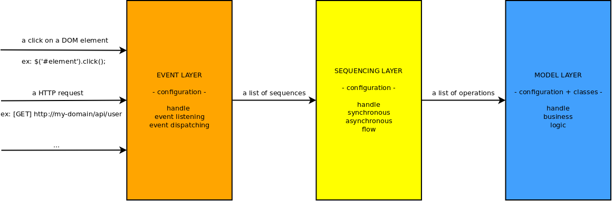

Danf Full Documentation
=======================

[←](../index.md)

If you are a begginer in Danf, you certainly should not try to master all this documentation right now, but instead use it as a reference to find specific informations when needed.

If you do not find what you are looking for in this documentation, feel free to post a question on [stackoverflow](http://stackoverflow.com/) with the tag `[danf]` or in the [issues](https://github.com/gnodi/danf/issues) if you think you have a bug or an interesting idea for an additional feature.

Learn more about the core features of the framework:

* [Configuration](core/configuration.md)
* [OOP](core/oop.md)
* [Dependency injection](core/dependency-injection.md)
* [Sequencing](core/sequencing.md)
* [Events](core/events.md)
* [Ajax app](core/ajax-app.md)
* [Testing](core/testing.md)

Learn how to do things with Danf:

* [How to use cookies](how-to/cookies.md)
* [How to handle the session](how-to/session.md)
* [How to redirect a HTTP request](how-to/redirect.md)
* [How to configure the cluster](how-to/cluster.md)
* [How to works with public assets (images, css, ...)](how-to/assets.md)
* [How to use ES6 class syntaxic sugar](how-to/es6-class.md)

[←](../index.md)